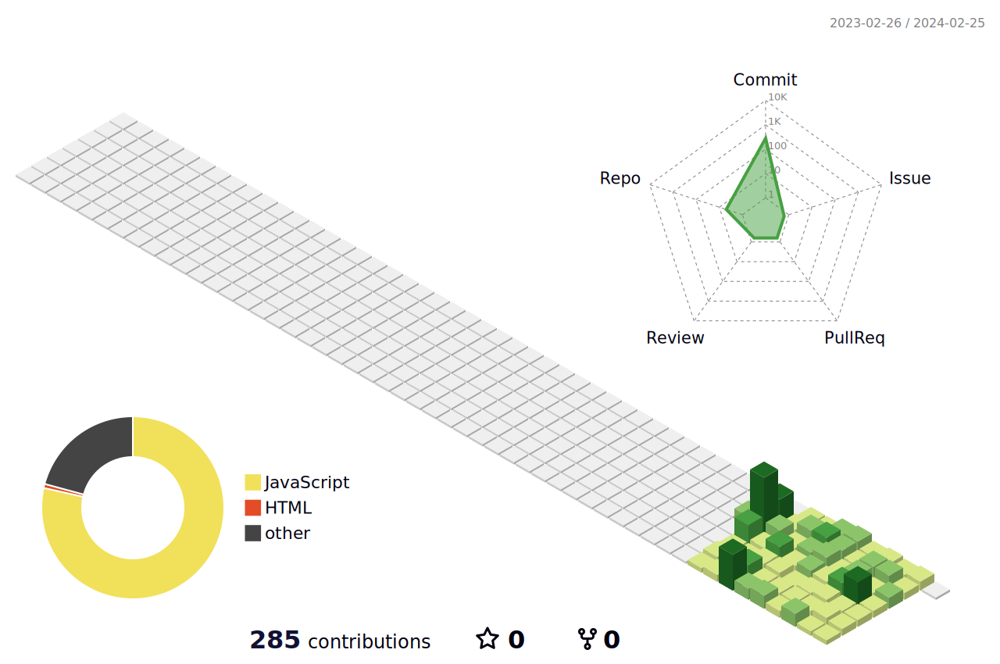

### Welcome To My Github!💚

## Mellie
<li>👩🏻‍💻 <strong>web front-end Developer</strong> since 2022.06</li>
<li>primarily work on web development using <strong>React and JavaScript</strong></li>
<li>also working with <strong>Node.js and MSSQL</strong></li>
<li>So, I am <i>familiar</i> with the flow of sending and receiving data between the database, Node.js, and the web.</li>  

 

### SKILLS 

 

 
 

 

